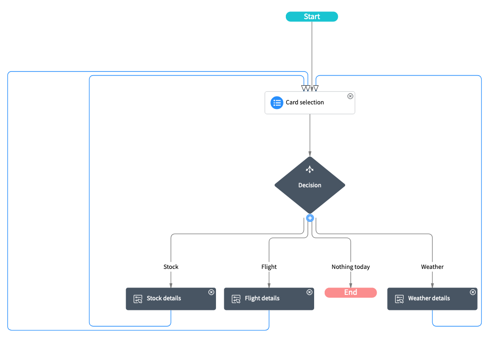
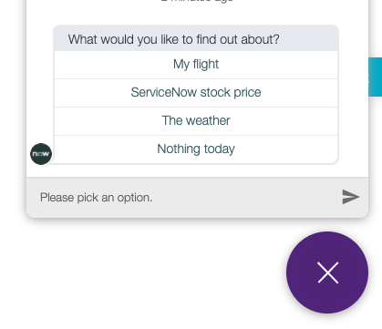
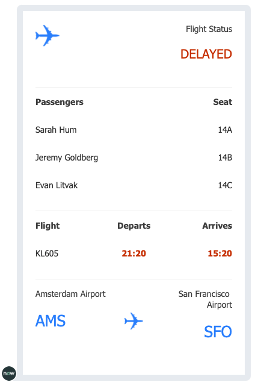
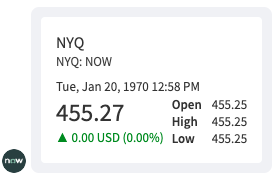
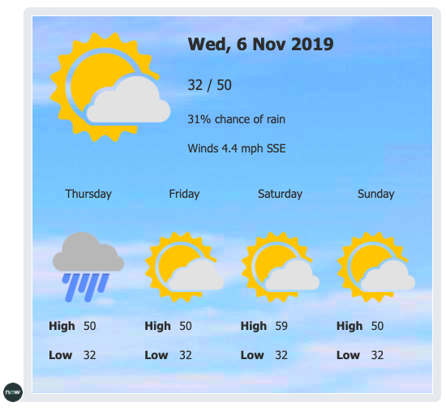

# Adaptive Cards for Virtual Agent
This is a proof-of-concept application for using [Adaptive Cards](adaptivecards.io/) within [ServiceNow Virtual Agent](https://www.servicenow.com/products/virtual-agent.html).

In the Paris release of ServiceNow, the ability to [define your own custom controls](https://docs.servicenow.com/bundle/paris-performance-analytics-and-reporting/page/administer/virtual-agent/concept/custom-controls.html) in Virtual Agent was added. This allows you to embed a Now Experience UI Framework component inside the VA interface, offering complete freedom for VA to respond with rich, interactive content.

When showing informaton from within ServiceNow, building a Now Experience UI Framework component tailored to the specific use case is the best soluton. However, when showing information from other systems sometimes they may offer not just the data, but an Adaptive Card representation of the data as well. This custom component allows you to supply this Adaptive Card representation  to Virtual Agent and it will be rendered in the interface.

##Requirements
- Paris Patch 3, or later version

##Installation
1. Download the XML of the latest release from the [release page](https://github.com/dylanlindgren/va-adaptive-cards/releases).
2. Use the [instructions on SN Pro Tips](https://snprotips.com/installing-an-update-set-from-xml) to upload the XML file to your instance, preview, and commit it.

##Examples
The application comes with an example conversation which you can use to see how to use the application and the component within your own conversations.

###Demo Video

<video width="320" controls>
  <source src="resources/0-demo.mp4" type="video/mp4">
</video>

###Example Conversation

###Example Steps

| Name           | Screenshot | Notes |
|----------------|------------|-------|
| Initial        |            |       |
| [Flight details](https://adaptivecards.io/samples/FlightUpdate.html) |            |       |
| [Stock ticker](https://adaptivecards.io/samples/StockUpdate.html)   |            |       |
| [Weather](https://adaptivecards.io/samples/WeatherLarge.html)        |            |       |

##Usage
The included Adaptive Card custom control has two inputs:

- `card_data`: The data JSON of the card, as shown in examples on the [Adaptive Card sample website](https://adaptivecards.io/samples/).
- `card_template`: The template JSON of the card, as shown in examples on the [Adaptive Card sample website](https://adaptivecards.io/samples/).

##Notes
- Currently the only Adaptive Card action type that's supported is `Action.OpenUrl`. `Action.Submit` and `Action.ShowCard` are not supported.

##Contributing
Contributions to this application are welcome. Please fork this repo, and raise a merge request containing your features/bug fixes to contribute.