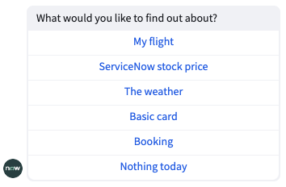
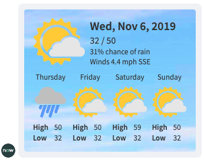

# Adaptive Cards for Virtual Agent

> Easily define custom layouts & data in Virtual Agent with Adaptive Cards


This is an application which allows display of [Adaptive Cards](adaptivecards.io/) within [ServiceNow Virtual Agent](https://www.servicenow.com/products/virtual-agent.html) conversations.

Virtual Agent (VA) allows you to embed a Now Experience UI Framework component inside it's interface as a [custom control](https://docs.servicenow.com/bundle/paris-performance-analytics-and-reporting/page/administer/virtual-agent/concept/custom-controls.html), offering complete freedom to respond with rich, interactive content in the conversation.

Most of the time, building a Now Experience UI Framework component tailored to the specific use case for the data to display is the best soluton.

However, this application is for situations where it is prefereable to use an Adaptive Card, for example when showing information from other systems sometimes they may offer not just the data, but an Adaptive Card representation of the data as well.

This custom component allows you to supply an Adaptive Card template, and optional data to VA and it will be rendered in the interface.

## Requirements
This application requires ServiceNow Paris Patch 3, or later version

The following plugins are required:

- Glide Virtual Agent (com.glide.cs.chatbot)

No ServiceNow Store applications are required.

## Installation

To install the required dependencies, from the Application Navigator open **REST API Explorer** (under System Web Services > REST).

From there, open the **CICD Batch Install API** in the **sn_cicd** namespace.

From there, use the **Install a set of applications and plugins based on installation plan** POST request.

Paste the following into the **Raw** body field and press **Send**.

```
{
   "name":"Adaptive Cards for Virtual Agent Dependencies",
   "packages":[
      {
         "id":"com.glide.cs.chatbot",
         "load_demo_data":true,
         "type":"plugin"
      }
   ]
}
    
```
In the response from this API you will see a "results" Sys ID. You can send this in the **result_id** parameter of the **Get the results of a batch install plan** request to check the status of your installation.

Once the dependencies are installed, install the core application via the following instructions:

1. Fork this repository into a new one controlled by your GitHub account.
2. Use the [instructions](https://docs.servicenow.com/en-US/bundle/sandiego-application-development/page/build/applications/task/t_ImportAppFromSourceControl.html) on the ServiceNow Documentation website to import the application from your GitHub repository into your development instance.

## Usage
There are two custom control topics included in the application. 

### Simple adaptive card (custom control topic)

This topic will be the one used for most use cases. It simply displays an adaptive card, and that's it.

This topic supports the `Action.OpenUrl` action and has two inputs:

#### `card_data`

The data JSON of the card, as shown in examples on the [Adaptive Card sample website](https://adaptivecards.io/samples/).

#### `card_template`

The template JSON of the card, as shown in examples on the [Adaptive Card sample website](https://adaptivecards.io/samples/).

### Adaptive card (custom control topic)

This topic will be used in use cases where the card requires an action be taken, and once that action is taken the card updates to a "closed" state. For example, in the "Input Form" example below the user is first asked to complete a form, and then once the user submits the form the virtual agent responds with the same component.

This topic supports both the `Action.OpenUrl` and `Action.Submit` actions.

It has both inputs that exist on *Simple adaptive card*, along with an additional two:

#### `card_template_closed`

The template JSON of the card when it is in closed state, as shown in examples on the [Adaptive Card sample website](https://adaptivecards.io/samples/). 

This field is optional. If not supplied, the JSON in the `card_template` input will be used instead.

Data from the user response is accessible within the card template through the root property `sncWdsVaAdaptiveCardResponse`. For example `${$root.sncWdsVaAdaptiveCardResponse.myName}` would access the `myName` property on the response object.

#### `display_closed_input_control`

Whether to show the card once it has been responded to. If unchecked, when the first card to display is responded to it will be replaced with the message "Your response has been captured. Thanks.". This option being unchecked stops the card from showing twice.

### Creating Adaptive Cards
There are a large number of [samples of adaptive cards on the official website at AdaptiveCards.io](https://adaptivecards.io/samples/). There is also a great [Adaptive Card Designer](https://adaptivecards.io/designer) which you can use to customise these example adaptive cards, or create your own from scratch. You can even supply sample data, and it will show how it displays.

## Examples
The application comes with an example topic called "Adaptive Cards Example Topic" which you can test to see what is possible in your own conversations.

### Demo Video

https://user-images.githubusercontent.com/6241518/174955551-8da8c8c7-538a-4a6c-a273-f3f4f404d436.mp4

### Example Conversation


### Example Steps

| Name           | Screenshot | Custom Control Topic Used |
|----------------|------------|-------|
| Initial        |            |    N/A   |
| [Flight details](https://adaptivecards.io/samples/FlightUpdate.html) |            |   Simple adapative card    |
| [Stock ticker](https://adaptivecards.io/samples/StockUpdate.html)   |            |   Simple adapative card    |
| [Weather](https://adaptivecards.io/samples/WeatherLarge.html)        |            |     Simple adapative card  |
| [Input Form](https://adaptivecards.io/samples/InputFormWithLabels.html)        |             |   Adapative card    |

## Notes
- Currently the `Action.ShowCard` action is not supported by either custom control topic.

## Contributing
Contributions to this application are welcome. Please fork this repo, and raise a merge request containing your features/bug fixes to contribute.

## Legal
THE SOFTWARE IS PROVIDED "AS IS", WITHOUT WARRANTY OF ANY KIND, EXPRESS OR IMPLIED, INCLUDING BUT NOT LIMITED TO THE WARRANTIES OF MERCHANTABILITY, FITNESS FOR A PARTICULAR PURPOSE AND NONINFRINGEMENT. IN NO EVENT SHALL THE AUTHORS OR COPYRIGHT HOLDERS BE LIABLE FOR ANY CLAIM, DAMAGES OR OTHER LIABILITY, WHETHER IN AN ACTION OF CONTRACT, TORT OR OTHERWISE, ARISING FROM, OUT OF OR IN CONNECTION WITH THE SOFTWARE OR THE USE OR OTHER DEALINGS IN THE SOFTWARE.
